# Classification and Segmentation on CAGS Dataset

This project implements classification and segmentation tasks on the CAGS dataset.

## Classification

### Overview
Fine-tune a classification head using features from a pre-trained backbone model.
- **Model**: EfficientNet (tf_efficientnetv2_b0.in1k) loaded with timn python library.

### Training Data
- Images: Normalized 224x224x3 from CAGS dataset.

### Training Pipeline
1. Freeze the backbone model and pass images through to obtain features
2. Pass features through the classification head to obtain logits
3. Compute cross-entropy loss on logits and gold distribution

### Results
- **Accuracy**: 94% on dev set (after 5 epochs)
- **Sample Predictions**:

  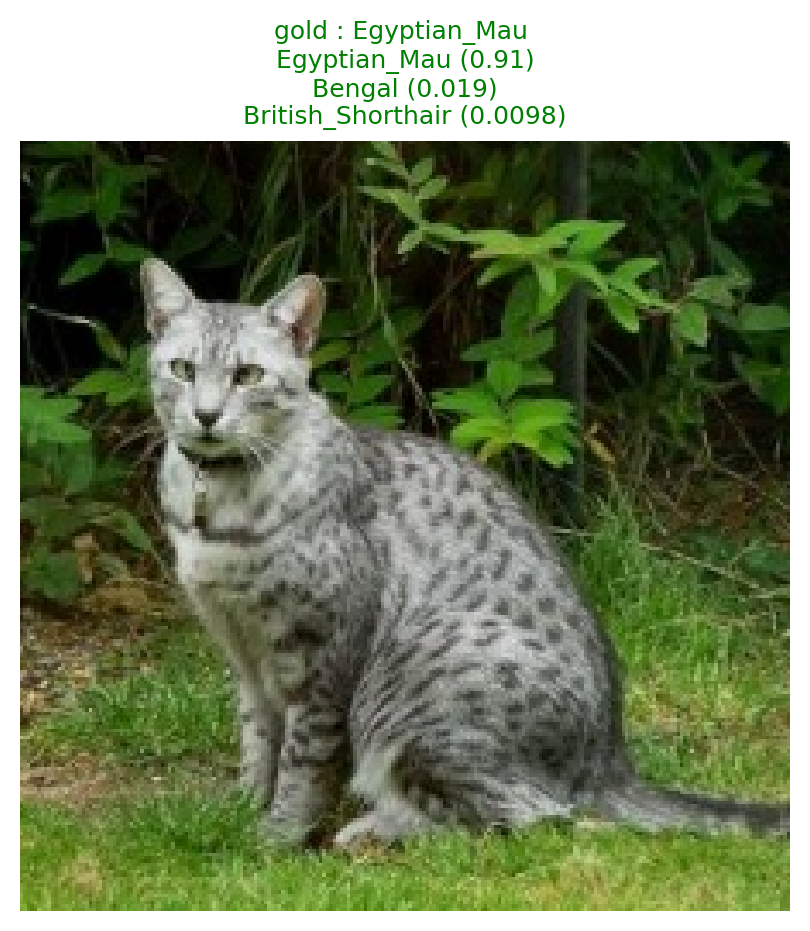
  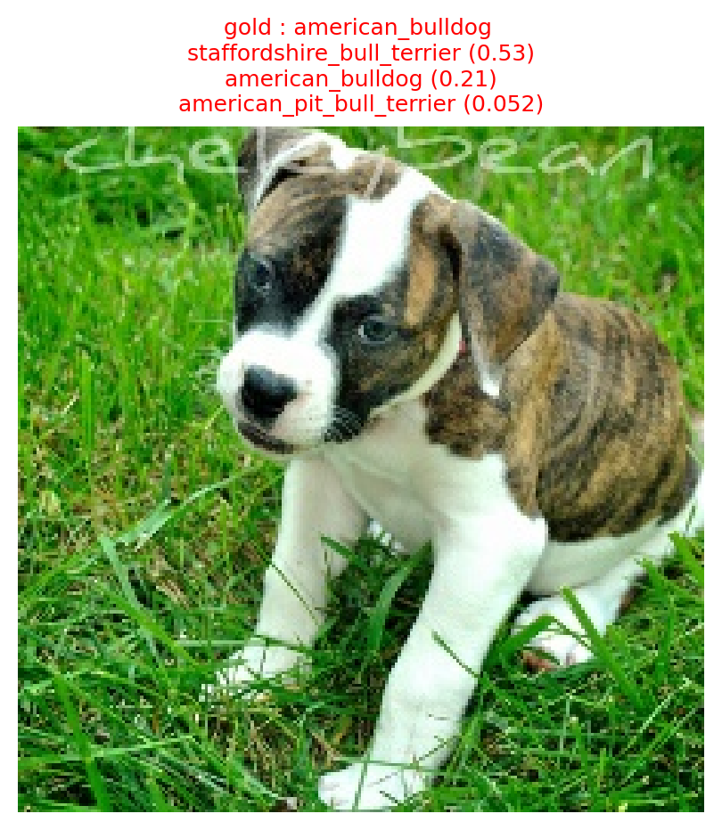
  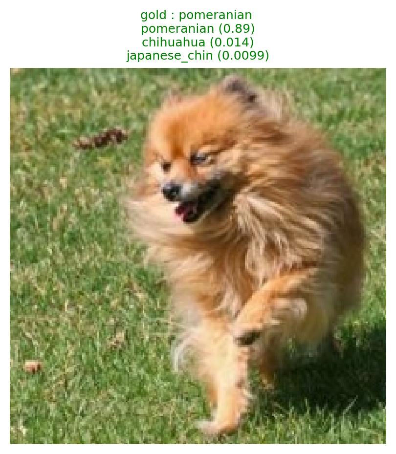
  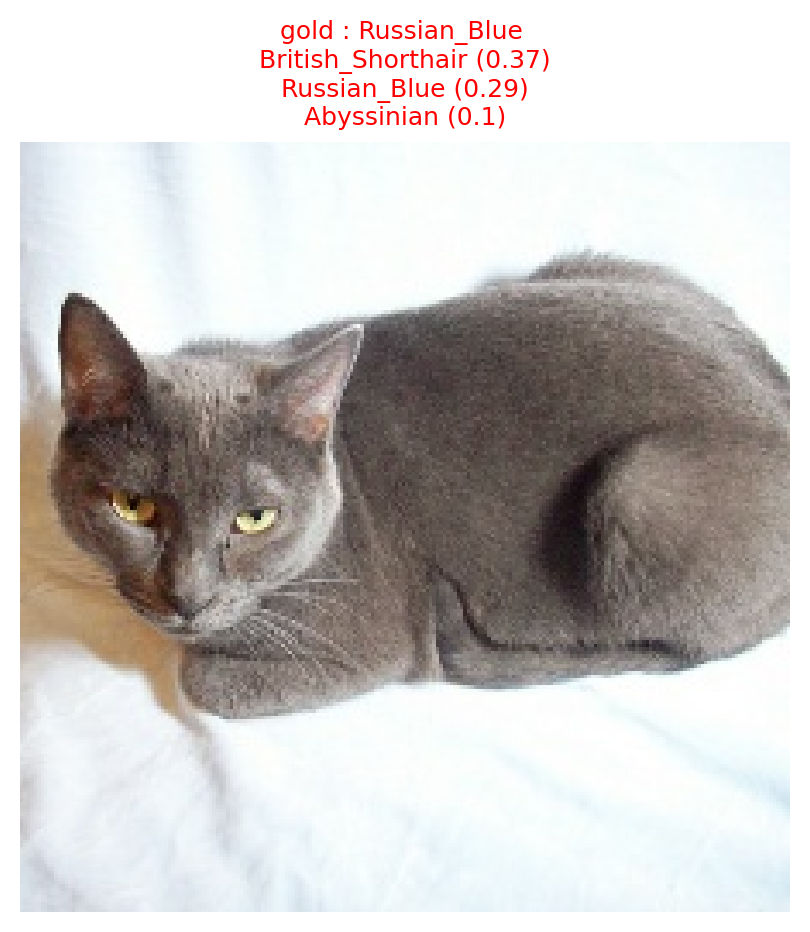
  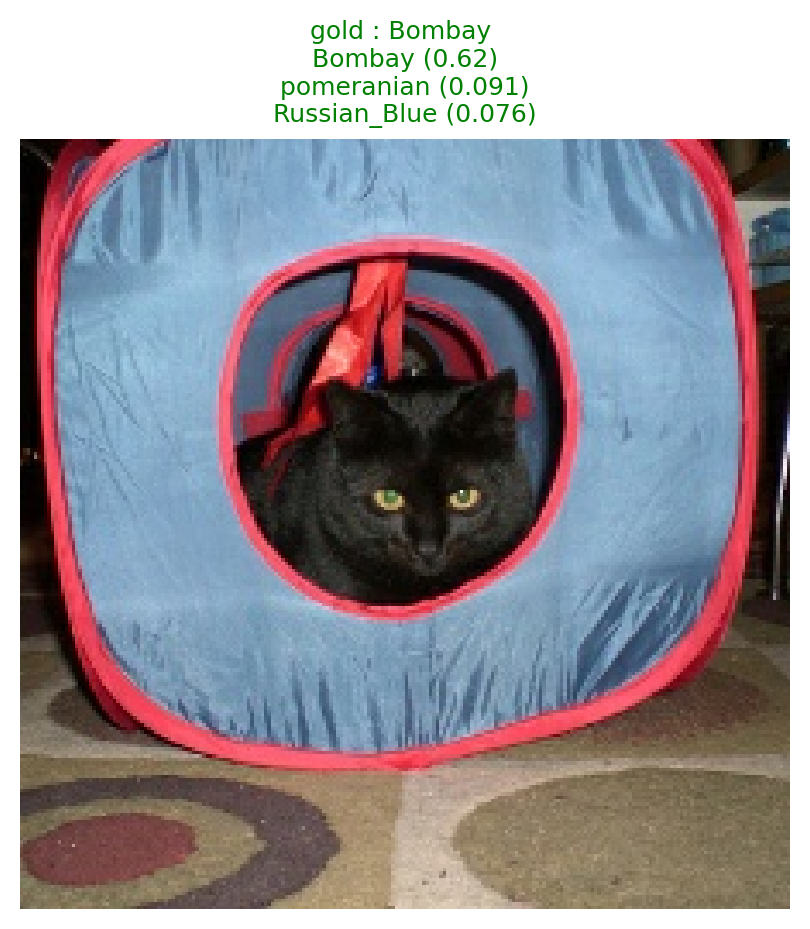
  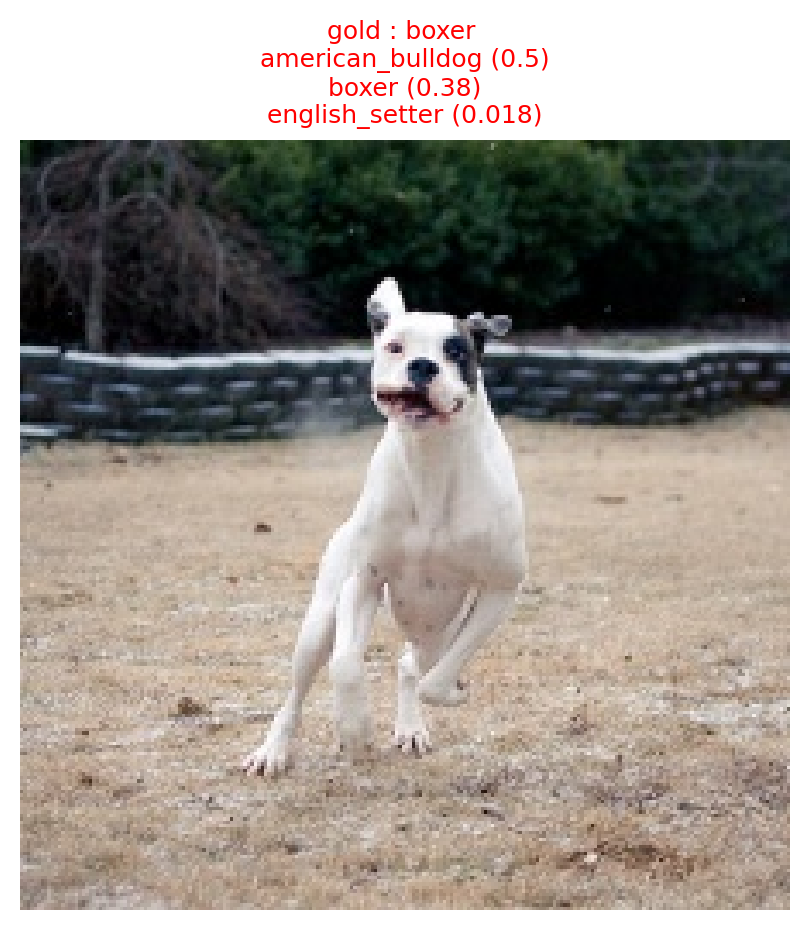

---

## Segmentation

### Overview
Build a model based on an inverse feature pyramid network to segment objects in images.

### Architecture
- Extract features from the backbone in the last 5 stages
- Use upsampling and concatenation with previous stage features to aggregate pixel-level information
- Progressively upsample until reaching original image resolution

### Training Data
- Images: 224x224x3 from CAGS dataset
- Masks: 224x224

### Training Pipeline
1. Freeze the backbone and pass images through to obtain a list of features
2. Pass features through upsampling blocks and concatenate with previous stage features
3. Repeat step 2 five times until reaching original image resolution
4. Compute binary cross-entropy loss on logits and golden mask
5. Generate predictions on test set

### Upsampling Blocks
Based on the approach from the [lecture slides](https://ufal.mff.cuni.cz/~straka/courses/npfl138/2526/slides.pdf/npfl138-2526-05.pdf), with modifications inspired by [this study](https://arxiv.org/abs/1803.02192).

Each upsampling block combines:
- Convolution
- Transposed convolution
- Batch normalization
- ReLU activation

### Model Architecture
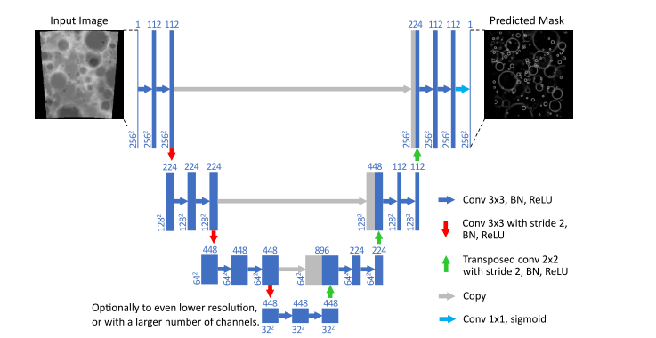

### Evaluation Metric
- **Metric**: Intersection over Union (IoU)
- **Calculation**: (pixels overlapping between prediction and original mask) / (pixels in union of masks)

### Results
Predicted masks and segmented images on test set:

  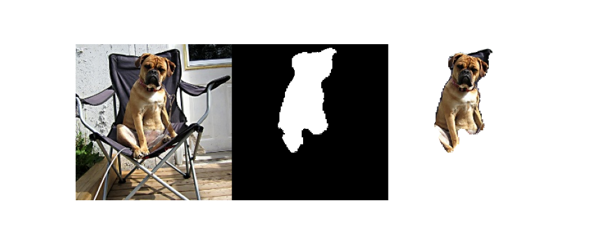
  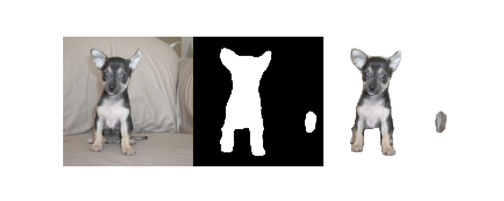
  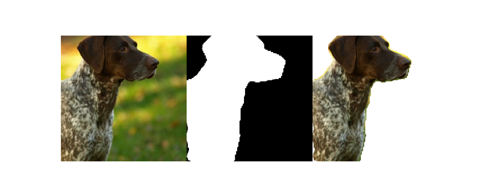
  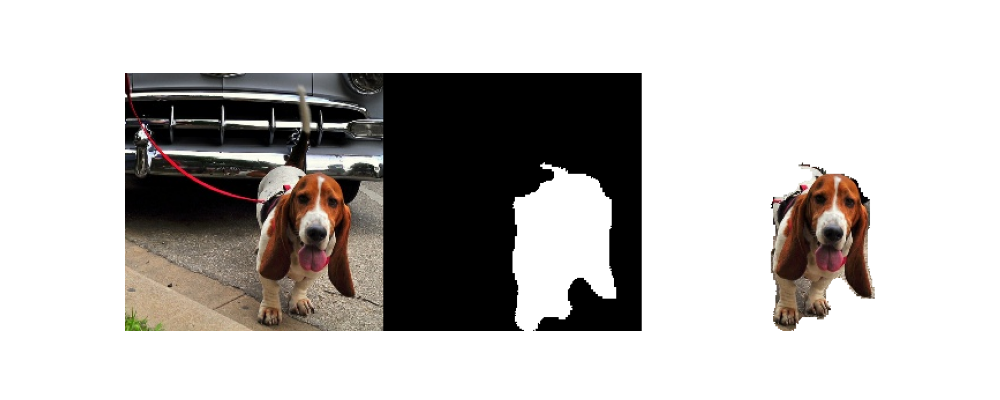
  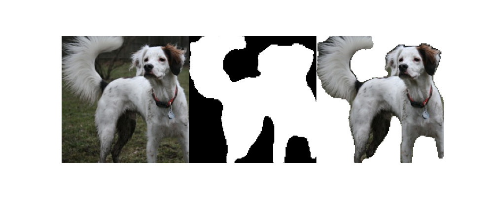

