# Object Detection

## Overview
This task trains a deep neural network to detect objects—specifically digits from the SVHN dataset. 
The model architecture is inspired by [RetinaNet model](https://arxiv.org/abs/1708.02002),
though simplified without the full FPN (feature pyramid network) approach. 
Instead, we use only 2 heads for regression and classification.

## Data

### Raw Data Format
- **Images**: NxNx3 (N varies per image)
- **Bounding Boxes**: For every object in the image
- **Object Labels**: Digits (0-9)

### Data Processing
Images are preprocessed by:
1. Scaling to [0, 1]
2. Standardization
3. Resizing to 224x224

### Training Data Preparation
- Create a set of anchors
- Assign labels to each anchor using Intersection over Union (IoU) metric
- Process training bounding boxes in RCNN-style

### Raw Data Visualization

  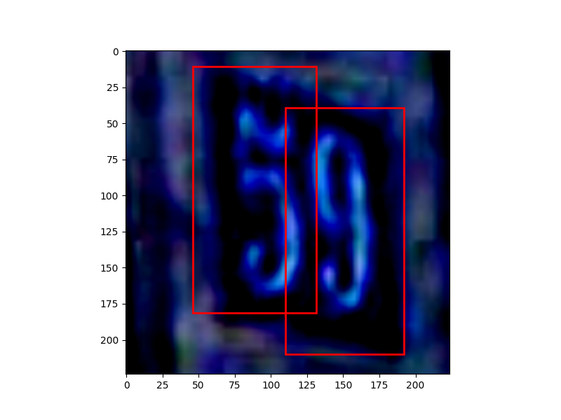
  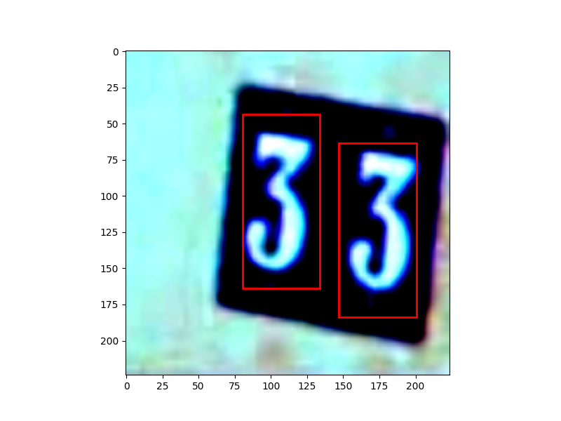
  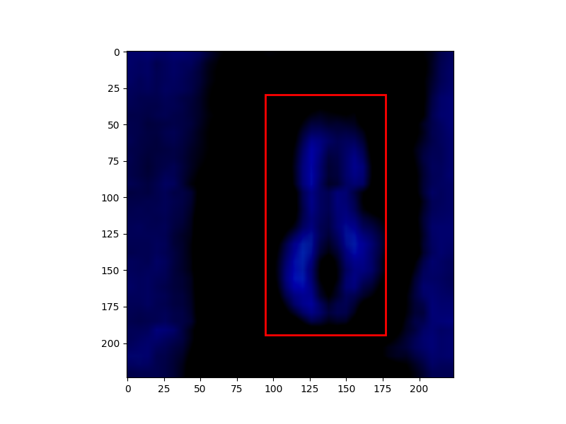
  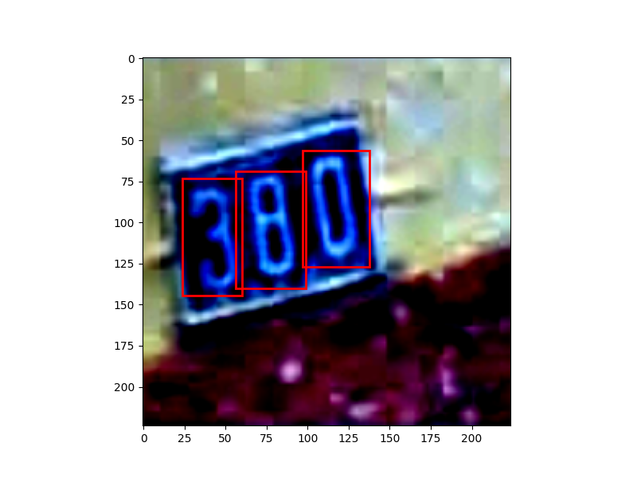
  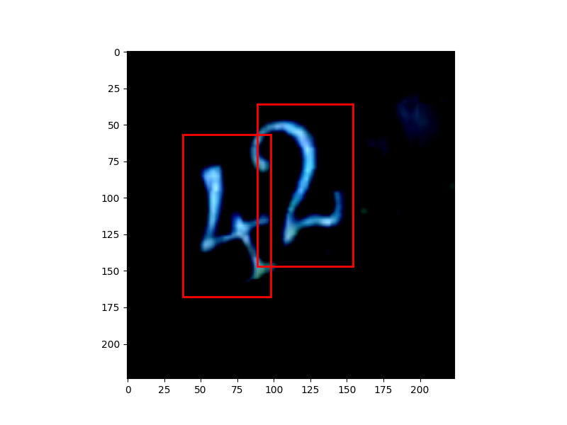
  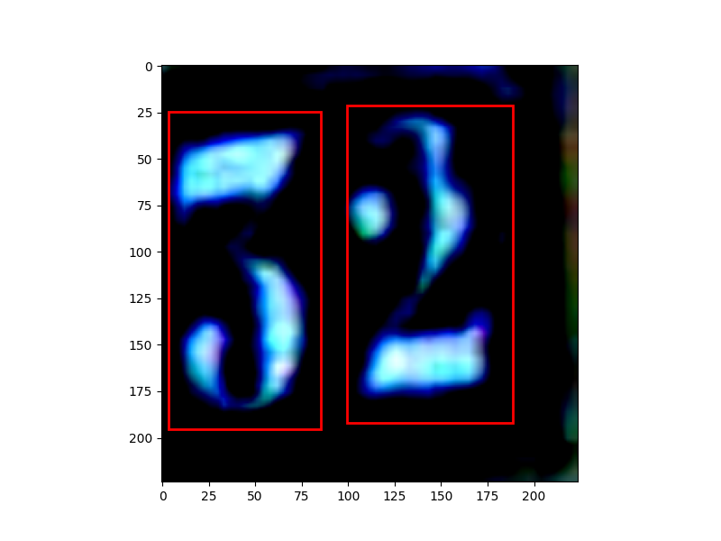

---

## Model Architecture

### Backbone
- **Model**: EfficientNet

### Heads
- **Classification Head**: 5 convolutional layers producing raw logits
- **Regression Head**: 5 convolutional layers producing raw logits

### Forward Pass
1. Backbone produces features from input images
2. Features are passed through both classification and regression heads
3. Heads output logits for each anchor

---

## Loss Function

### Combined Loss
- **Classification Loss**: Focal loss
- **Regression Loss**: Huber L1 loss

### Regression Loss Details
- Computed only on predictions for positive anchors
- "Positive" = anchor has significant intersection with gold bounding box

---

## Prediction Generation

### Classification
- Apply sigmoid on classification logits
- Use threshold-based decision to determine foreground vs. background
- **Optimal Threshold**: 0.3

### Output
- For each anchor, determine if it corresponds to foreground or background

---

## Training Pipeline

1. Generate anchors of different sizes and scales
2. Load data in appropriate format:
   - Images: 3x224x224
   - Anchor bounding boxes: Ax4
   - Anchor classes: Ax1
3. Pass images through the backbone to extract features
4. Pass features through classification and regression heads
5. Compute combined loss and perform backward pass
6. Evaluate on dev set using custom evaluation callback
7. Generate final predictions

### Sample Predictions

  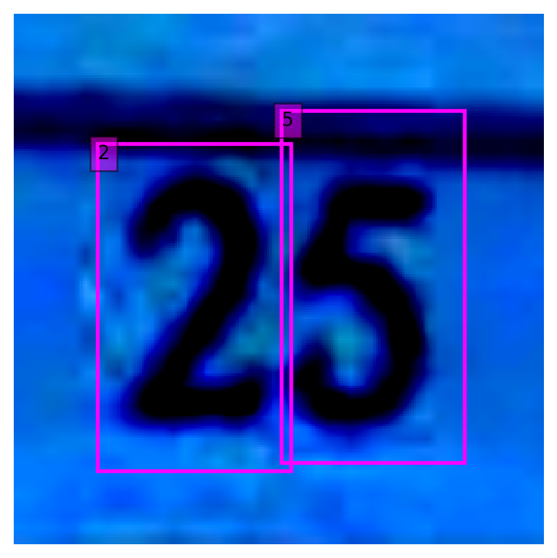
  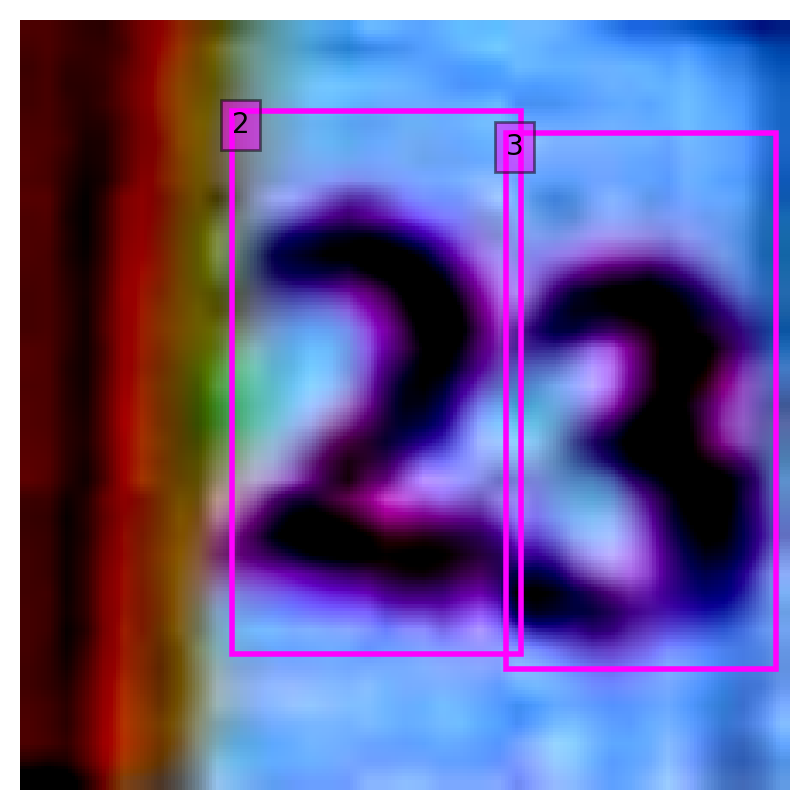
  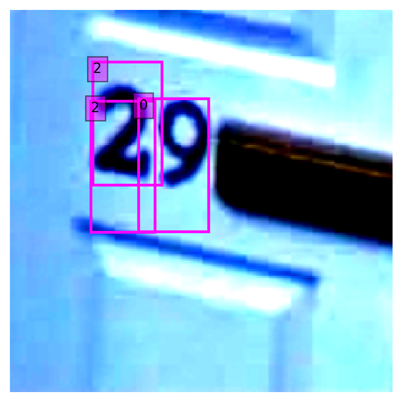
  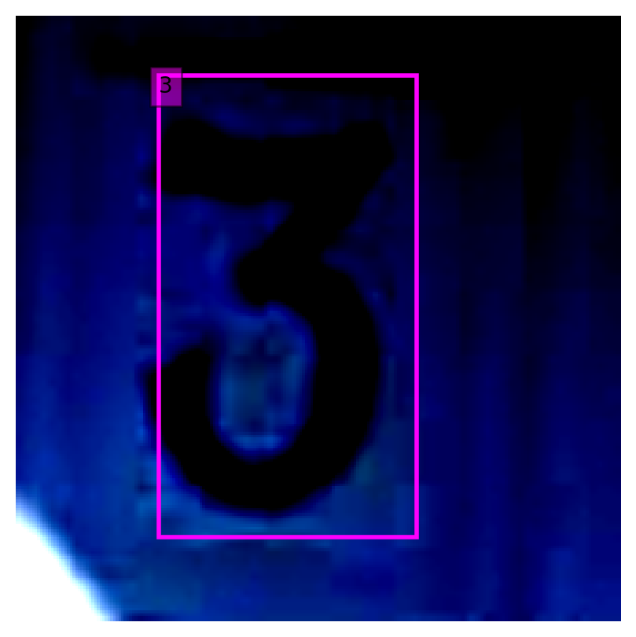
  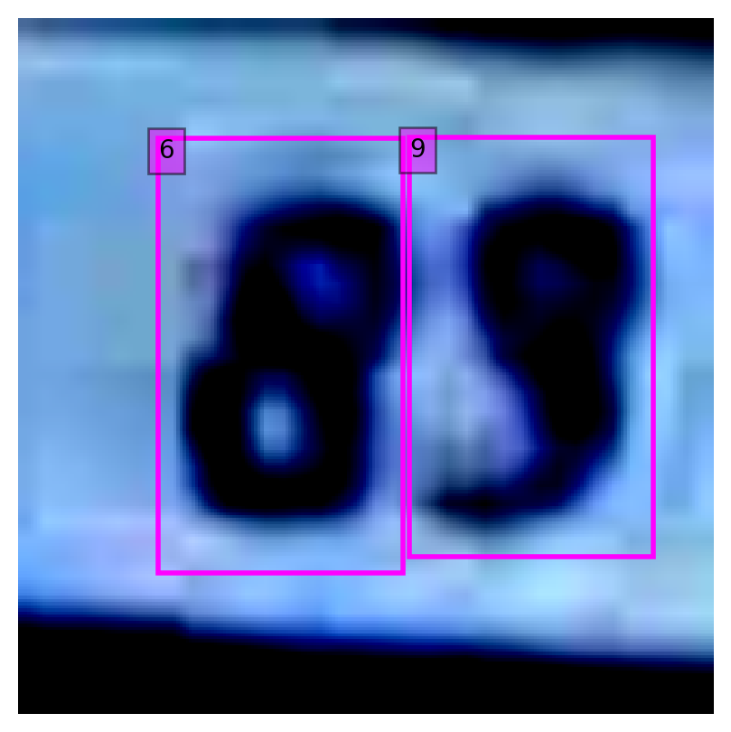
  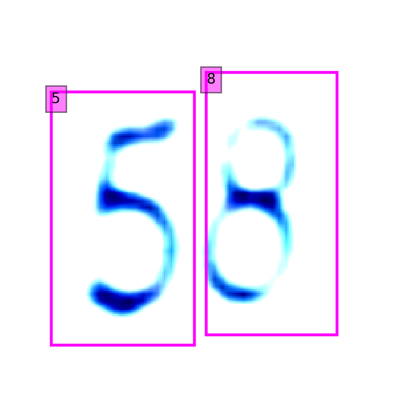
  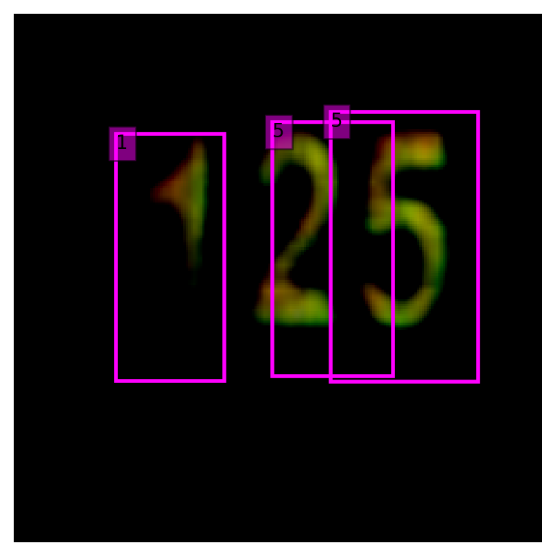
  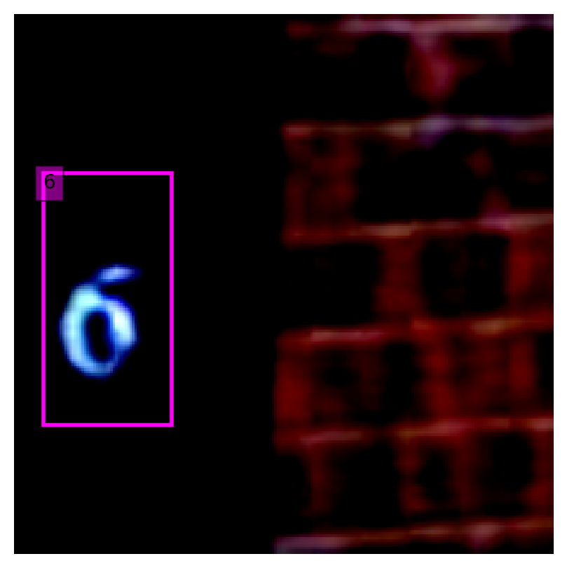
  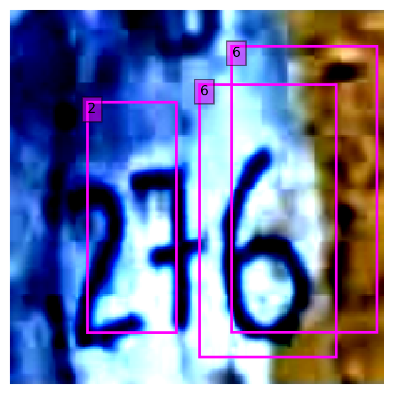

