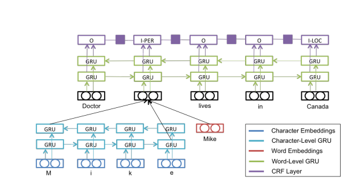

# RNNs and Part-of-Speech Tagging

## Overview
This task uses RNNs for sequence classification applied to part-of-speech (POS) tagging. The model architecture is based on the approach shown below:



### Dataset
- **Source**: Morpho dataset for Czech words and their corresponding POS tags

### Raw Data Format
Each example contains:
1. Sentences (list of words)
2. Lemmas (list of lemmas corresponding to words)
3. Tags (part-of-speech tags)

### Training Data Preparation
Training data is prepared as:
- Tensors for word indices into vocabulary
- Unique word character representations
- Tensor of word indices into unique words

---

## Model Architecture

### Training Pipeline
1. Embed the words themselves
2. Produce Character-Level Embeddings (CLE) for unique words
3. Pass CLE through bidirectional GRU cell and concatenate forward and backward hidden states
4. Concatenate with word embeddings and pass through bidirectional LSTM cell
5. Take outputs, add them, and pass through classification layer
6. Compute cross-entropy loss on produced logits and perform backward pass

---

## Training Log

```
Epoch 1/5 202.2s loss=1.9919 accuracy=0.5418 dev:loss=0.7709 dev:accuracy=0.8079
Epoch 2/5 198.1s loss=0.4976 accuracy=0.8715 dev:loss=0.3865 dev:accuracy=0.8989
Epoch 3/5 228.1s loss=0.2588 accuracy=0.9311 dev:loss=0.2890 dev:accuracy=0.9229
Epoch 4/5 199.8s loss=0.1658 accuracy=0.9557 dev:loss=0.2338 dev:accuracy=0.9393
Epoch 5/5 199.1s loss=0.1177 accuracy=0.9683 dev:loss=0.2141 dev:accuracy=0.9451
```

---

## Samples from predictions (test data)

```
Telefon,i,fax,automaticky,opakují,poslední,čísla,.
NNIS1-----A----,J^-------------,NNIS1-----A----,Dg-------1A----,VB-P---3P-AAI--,AAFS4----1A----,NNNP4-----A----,Z:-------------,

Možnost,zkrácené,volby,až,třiceti,předvolených,16,místných,čísel,.
NNFS1-----A----,AAFS2----1A----,NNFS2-----A----,J^-------------,Cl-P2----------,AAIP2----1A----,C=-------------,AANP2----1A----,NNNP2-----A----,Z:-------------,

Ročně,by,měl,podnik,dodat,na,domácí,a,zahraniční,trh,30,tisíc,tun,ekologického,paliva,z,řepkového,oleje,.
Dg-------1A----,Vc----------I--,VpYS----R-AAI--,NNIS1-----A----,Vf--------A-P--,RR--4----------,NNFS7-----A----,J^-------------,AAIS4----1A----,NNIS4-----A----,C=-------------,CzIXX----------,NNFP2-----A----,AANS2----1A----,NNNS2-----A----,RR--2----------,AAMS2----1A----,NNIS2-----A----,Z:-------------,

Jednota,se,musela,přizpůsobit,a,postupně,i,ona,zajistila,dřívější,dovoz,chleba,z,okresní,pekárny,v,Prostějově,.
NNFS1-----A----,P7--4----------,VpQW----R-AAI--,Vf--------A-P--,J^-------------,Dg-------1A----,J^-------------,PEFS1--3-------,VpQW----R-AAP--,AAIS4----2A----,NNIS1-----A----,NNIS2-----A----,RR--2----------,AAFS2----1A----,NNFS2-----A----,RR--6----------,NNIS6-----A----,Z:-------------,
```
