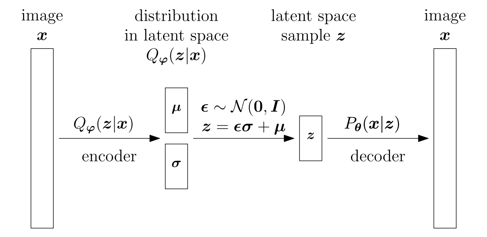
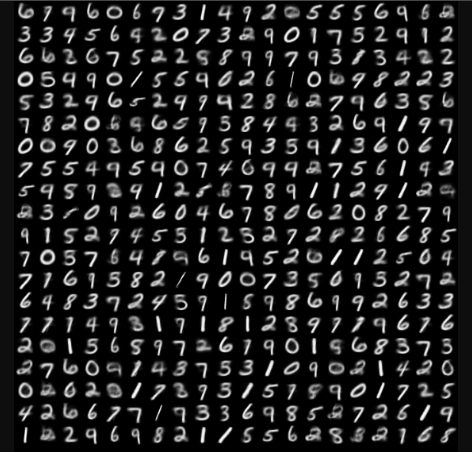
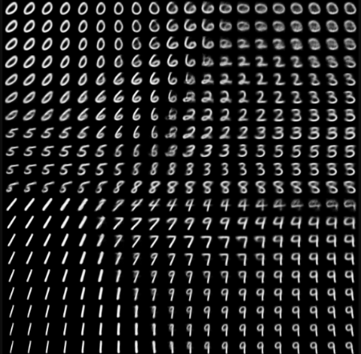
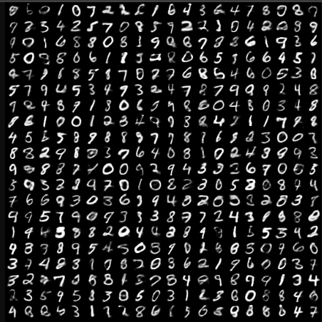
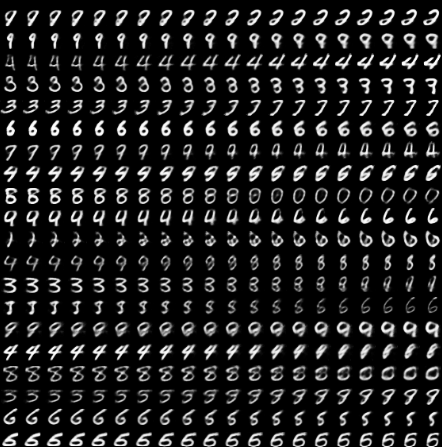
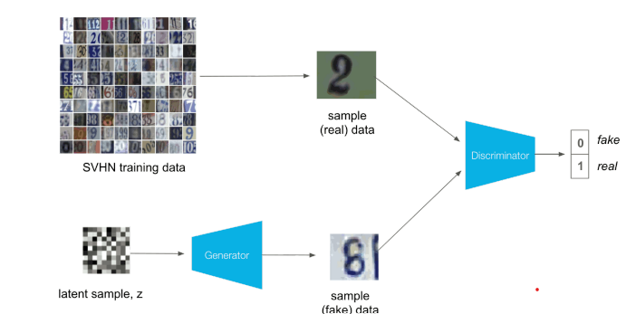
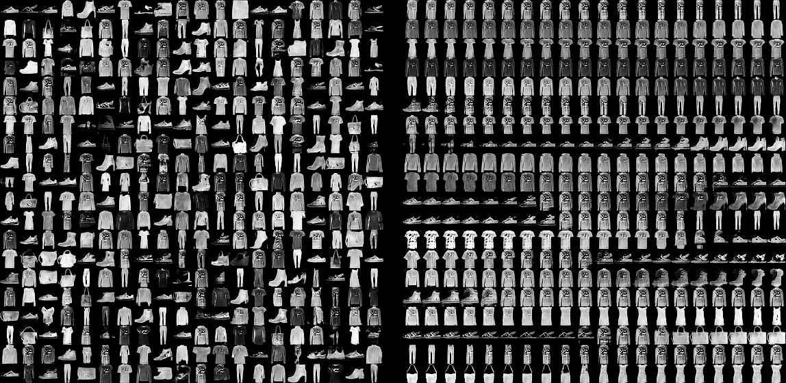

# In this section we implement simple generative models : 
1) Variational autoencoder
2) Deep convolutional GAN

# 1) Variational autoencoder

This task implements a Variational Autoencoder (VAE) that learns a probabilistic latent representation of MNIST handwritten digits.

## Model Overview

The VAE consists of:

- **Encoder**: Maps an input image into a latent Gaussian distribution.
  - Outputs the mean (`μ`) and standard deviation (`σ`) of the latent variables.
- **Latent space**: Samples latent vectors using the reparameterization trick.
- **Decoder**: Reconstructs images from latent vectors.

**Loss** = Reconstruction Loss + KL Divergence Loss
where:

- **Reconstruction loss** measures how well the decoder recreates the input image.
- **KL divergence** forces the latent distributions to stay close to \(N(0,I)\), creating a smooth latent space suitable for generation.

## Results 
Training : 50 epochs, BS-30, Adam optimizer with default lr
Images show - decoded random samples from the decoder and interpolated latent space
1) latent space dimension - 2

| Random samples                                | Interpolations |
|-----------------------------------------------|---|
|  |  |

2) latent space dimension - 100

| Random samples | Interpolations |
|---|---|
|  |  |

# 2) # DCGAN for MNIST-fashion

In this task we implement a **Generative Adversarial Network (GAN)** for generating images from MNIST-fashion dataset.

## Model Architecture
Overall architecture of the model can be visualized as : 

### Generator

The generator maps a latent vector sampled from a standard normal distribution to an image.

Architecture:

* Input: latent vector `z` (dimension `z_dim = 100`)
* Fully connected + Batch Normalization + ReLU
* Fully connected + Batch Normalization + ReLU
* Unflatten to feature maps
* Transposed Convolution + Batch Normalization + ReLU
* Transposed Convolution + Sigmoid
* Output: `28 × 28` grayscale image

### Discriminator

The discriminator is a binary classifier that predicts whether an image is **real** or **generated**.

Architecture:

* Input: `28 × 28` grayscale image
* Convolution + Batch Normalization + ReLU + Max Pooling
* Convolution + Batch Normalization + ReLU + Max Pooling
* Flatten
* Fully connected + Batch Normalization + ReLU
* Fully connected + Sigmoid
* Output: probability that the image is real

## Training

The generator and discriminator are trained alternately.

* **Discriminator**

  * Learns to classify real MNIST images as **1**.
  * Learns to classify generated images as **0**.

* **Generator**

  * Generates images from random latent vectors.
  * Tries to fool the discriminator by making generated images classified as **real** (target label **1**).

Both networks are optimized using Binary Cross Entropy (BCE) loss and Adam optimizers.
## Results
After 50 training epochs, the generator produced the images shown above. As in the VAE experiments,
we present both images generated from random samples drawn from the prior distribution and images obtained by interpolating between latent vectors,
illustrating the continuity of the learned latent space.
 

