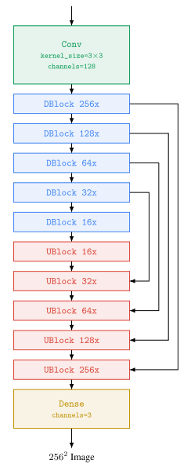
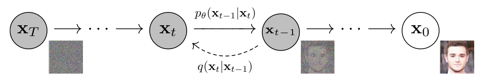
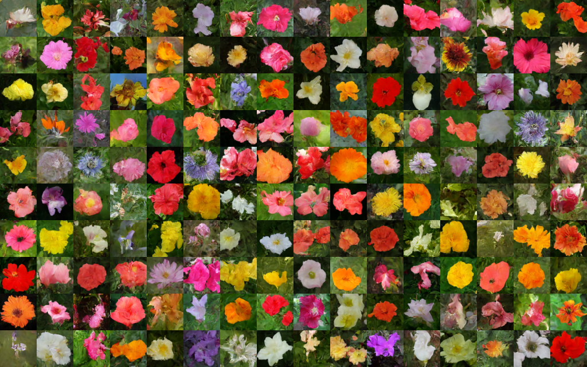
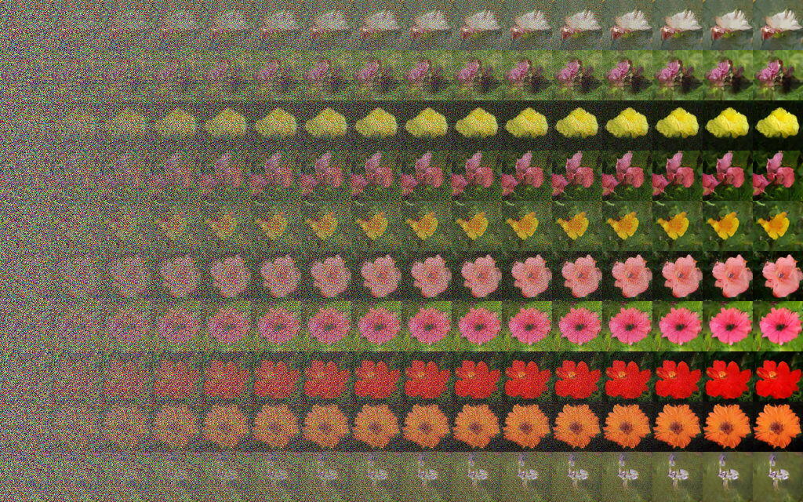

# Flow Matching Image Generation

This task implements an image generation model using **Conditional Flow Matching**. The model learns a continuous vector field that transports samples from a Gaussian noise distribution to the distribution of real images.
In the first part we implement U-net architecture for vector field prediction. In the second part we add self-attention over the image pixels features.

## Model Overview

The model consists of a U-Net architecture with:

* sinusoidal time embeddings,
* residual blocks,
* downsampling and upsampling stages,
* skip connections.

U-Net architecture : 

The network learns a time-dependent velocity field:

$$
v_\theta(x_t,t)
$$

which describes how a noisy image should move through the data space.

## Training

During training, each image is paired with random Gaussian noise:

$$
x_0 \sim \mathcal{N}(0,I)
$$  

A random time step is sampled:

$$
t \sim U(0,1)
$$

and an intermediate sample is created using a linear optimal transport path:

$$
x_t =
(1-(1-\sigma_{\min})t)x_0+t x_1
$$

where (x_1) is the real image.

The target velocity is obtained from the derivative of this path:

$$
u_t=x_1-(1-\sigma_{\min})x_0
$$

The model is trained by minimizing the difference between the predicted and target velocity:

$$
L = 
|v_\theta(x_t,t)-u_t|
$$

The implementation supports L1 or L2 loss.

## Generation

To generate new images, the model starts from random Gaussian noise and follows the learned vector field.

The continuous process:

$$
\frac{dx}{dt}=v_\theta(x,t)
$$

is solved numerically using Euler integration:

$$
x_{k+1} = x_k+\Delta t*v_\theta(x_k,t_k)
$$

After several steps, the noise is transformed into a generated image.

## Exponential Moving Average (EMA)

During training, an EMA copy of the model parameters is maintained and used for generation. This improves stability and sample quality.

## Generated images
Generated images after 100 epochs of training : 

Genrated flow trajectories for images after training : 

7

# Attention-mechanism

The U-Net architecture is enhanced with self-attention blocks to allow features at different spatial locations to communicate globally.

Given an intermediate feature map:

$$
X \in \mathbb{R}^{B \times C \times H \times W}
$$

the feature map is reshaped into a sequence of spatial tokens:

$$
X \rightarrow \mathbb{R}^{B \times (H \cdot W) \times C}
$$

where each spatial location becomes one token with (C) features.

The attention mechanism computes:

$$
Q=XW_Q,\qquad K=XW_K,\qquad V=XW_V
$$

and produces:
$$
\text{softmax}\left(\frac{QK^T}{\sqrt{d_k}}\right)V
$$

In this model, self-attention is applied using:

$$
Q=K=V=X
$$

## Results 
# TO  DO 